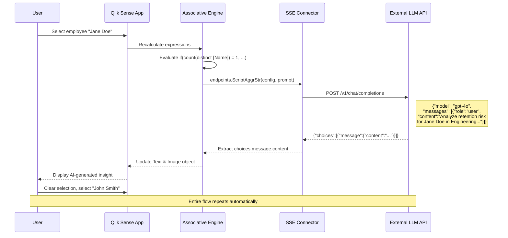
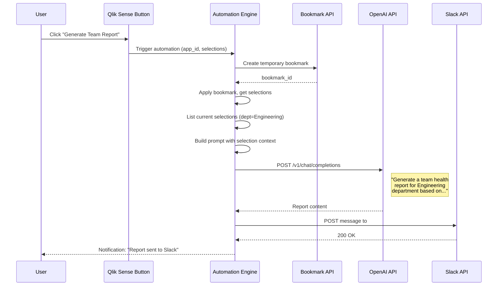
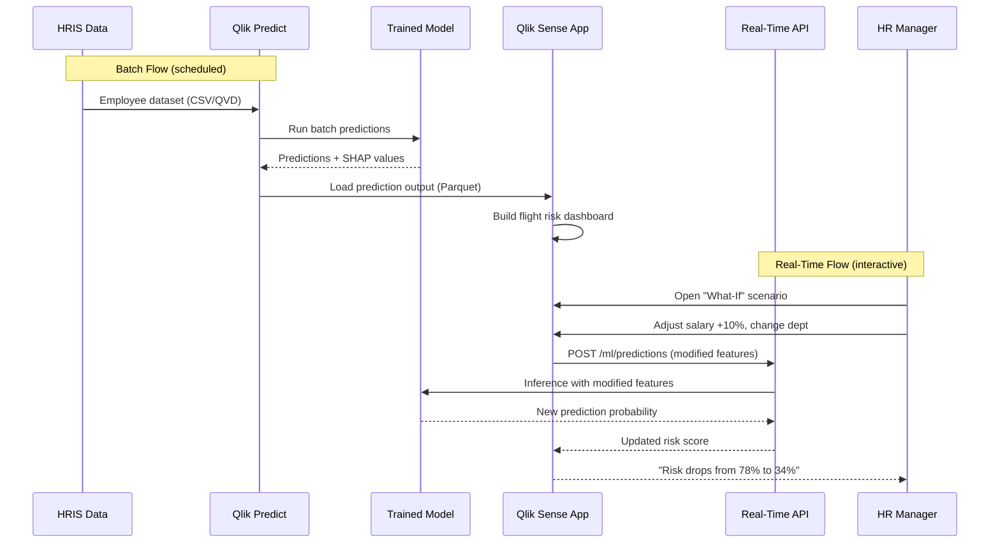
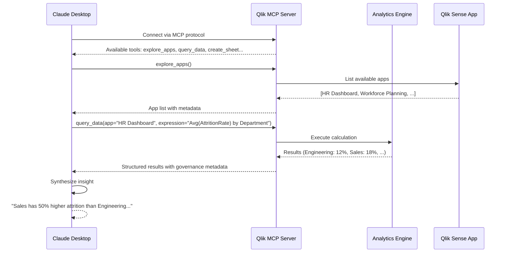

# C4 Model — Level 4: Code-Level Patterns

Shows implementation patterns for key integration points.

## Pattern: Analytic Connection Chart Expression (LLM Call)



### Qlik Expression Code

```
// Gate behind single selection to control API costs
if(count(distinct [EmployeeID]) = 1,
   endpoints.ScriptAggrStr(
     '{"RequestType":"endpoint",
       "endpoint":{
         "connectionname":"OpenAI_HR_Analysis",
         "column":"choices.message.content"
       }
     }',
     'You are an HR analytics expert. Analyze the following employee data '
     & 'and provide a retention risk assessment with specific recommendations. '
     & chr(10) & chr(10)
     & 'Employee: ' & only([EmployeeName])
     & chr(10) & 'Department: ' & only([Department])
     & chr(10) & 'Tenure: ' & only([YearsAtCompany]) & ' years'
     & chr(10) & 'Performance Rating: ' & only([PerformanceRating])
     & chr(10) & 'Predicted Attrition Risk: ' & only([AttritionProbability])
     & chr(10) & 'Last Promotion: ' & only([YearsSinceLastPromotion]) & ' years ago'
     & chr(10) & 'Overtime: ' & only([OverTime])
   ),
   'Please select exactly one employee to view AI-powered retention analysis.'
)
```

## Pattern: Button-Triggered Automation with LLM



## Pattern: Qlik Predict Integration (Batch + Real-Time)



## Pattern: MCP Server Access (External AI)


