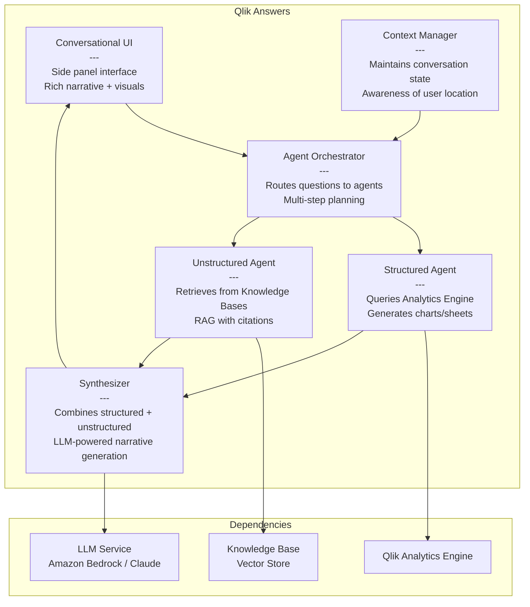
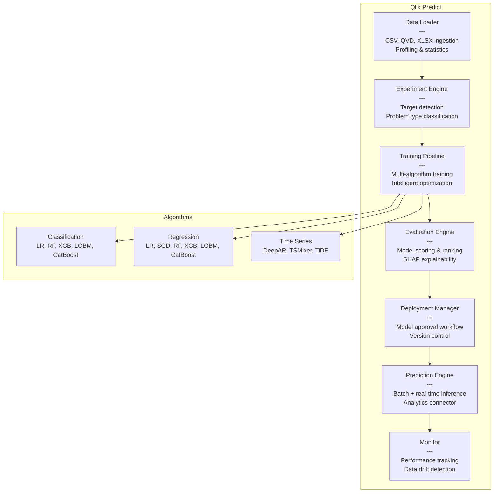

# C4 Model — Level 3: Component Diagram

Zooms into key containers to show their internal components.

## Component: Qlik Answers (Agentic Analytics)



## Component: Qlik Predict (AutoML)



## Component: Integration Layer (LLM Connections)

```mermaid
graph TB
    subgraph "Integration Layer"
        subgraph "Analytic Connections"
            SSE[SSE Protocol Handler<br/>---<br/>Server-Side Extension<br/>gRPC-based]
            OAI_C[OpenAI Connector]
            AZ_C[Azure OpenAI Connector]
            BED_C[Bedrock Connectors<br/>Anthropic, Titan, Cohere,<br/>Meta, Converse API]
            HF_C[Hugging Face Connector]
        end

        subgraph "Application Automations"
            TRIG[Trigger Manager<br/>---<br/>Button, webhook, schedule]
            BOOK[Bookmark Handler<br/>---<br/>Captures user selections<br/>as temporary bookmarks]
            OAI_A[OpenAI Automation Block]
            API_A[API Key Connector<br/>---<br/>Generic REST for any LLM]
            FLOW[Flow Engine<br/>---<br/>Data + logic blocks<br/>Error handling]
        end

        subgraph "MCP Server"
            MCP_E[Engine Access<br/>---<br/>Analytical calculations]
            MCP_T[Tool Access<br/>---<br/>App building, sheets, charts]
            MCP_A[Agent Access<br/>---<br/>Full agentic capabilities]
        end
    end

    subgraph "Qlik Sense App"
        CHART[Chart Expression<br/>endpoints.ScriptAggrStr()]
        BTN[Button Action<br/>Execute automation]
        LS[Load Script<br/>LIB CONNECT]
    end

    CHART --> SSE
    SSE --> OAI_C
    SSE --> AZ_C
    SSE --> BED_C
    SSE --> HF_C
    BTN --> TRIG
    TRIG --> BOOK
    BOOK --> FLOW
    FLOW --> OAI_A
    FLOW --> API_A
    LS --> SSE
```

## Key Component Interactions

| Component | Input | Output | Protocol |
|-----------|-------|--------|----------|
| Agent Orchestrator | User question + context | Routed to appropriate agent | Internal |
| Structured Agent | Analytical query | Engine calculations + chart specs | Analytics Engine API |
| Unstructured Agent | Document query | Retrieved passages + citations | Vector search |
| Synthesizer | Structured + unstructured results | Rich narrative with visuals | LLM API |
| SSE Protocol Handler | Chart expression data | LLM response text | gRPC / REST |
| Bookmark Handler | User selections | Temporary bookmark ID | Qlik API |
| Prediction Engine | Input data rows | Predicted values + probabilities | REST API |
