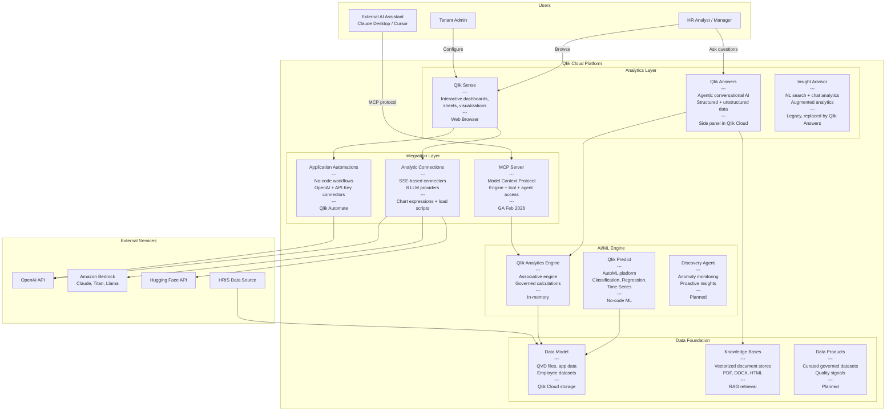

# C4 Model — Level 2: Container Diagram

Shows the major containers (services/applications) within the Qlik Cloud AI/ML ecosystem.

## Container Responsibilities

| Container | Technology | Responsibility |
|-----------|-----------|---------------|
| Qlik Sense | Web application | Interactive dashboards, visualizations, user interaction |
| Qlik Answers | Agentic AI service | Conversational analytics combining structured + unstructured data |
| Qlik Predict | AutoML platform | Model training, evaluation, deployment, predictions |
| Qlik Analytics Engine | In-memory engine | Governed calculations, associative data model |
| Discovery Agent | AI monitoring service | Continuous anomaly detection and proactive alerting |
| Analytic Connections | SSE connectors | Bridge between Qlik expressions and external LLMs |
| Application Automations | Workflow engine | No-code automation with external service integration |
| MCP Server | Protocol server | Exposes Qlik to third-party AI assistants |
| Knowledge Bases | Vector store | Document indexing and RAG retrieval |
| Data Products | Governed datasets | Curated data with quality signals |

## Data Flows

| Flow | Source | Target | Protocol | Latency |
|------|--------|--------|----------|---------|
| User query | Browser | Qlik Answers | HTTPS | <2s (target) |
| Analytical calculation | Qlik Answers | Analytics Engine | Internal | <500ms |
| Document retrieval | Qlik Answers | Knowledge Base | Internal | <1s |
| LLM chart expression | Analytics Connection | OpenAI/Bedrock | REST API | 2-10s |
| Automation workflow | Qlik Automate | External APIs | REST API | Variable |
| MCP request | External AI | MCP Server | MCP/HTTPS | 1-5s |
| Batch prediction | Qlik Predict | Data Model | Internal | Minutes |
| Real-time prediction | API client | Qlik Predict | REST API | <1s |
