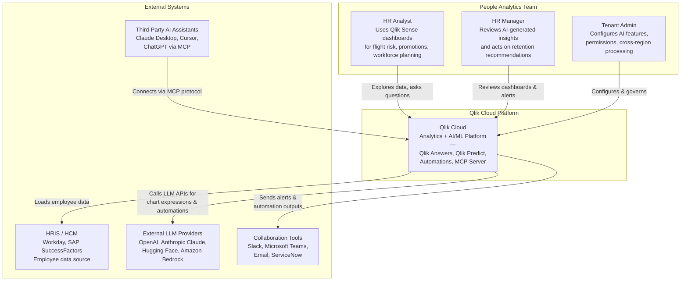

# C4 Model — Level 1: System Context Diagram

Shows how the Qlik Cloud AI/ML ecosystem interacts with external actors and systems.

## Key Relationships

| Actor/System | Interaction | Protocol |
|-------------|-------------|----------|
| HR Analyst | Explores Qlik Sense apps, asks Qlik Answers questions | HTTPS (browser) |
| HR Manager | Reviews dashboards, receives alerts | HTTPS, email, Slack |
| Tenant Admin | Configures cross-region processing, permissions, roles | Admin Console |
| HRIS | Source of employee data (CDC or batch) | REST API, ODBC, connectors |
| External LLMs | Called by analytic connections and automations | REST API |
| Collaboration Tools | Receive automation outputs (alerts, reports) | REST API, webhooks |
| Third-Party AI Assistants | Access Qlik via MCP Server | MCP protocol |
